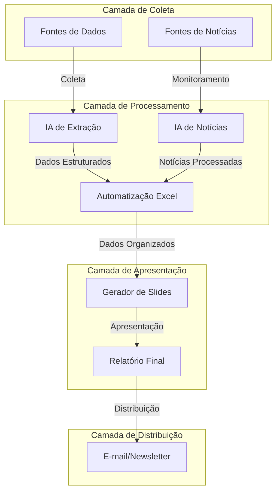

# Visão Geral da Arquitetura

## Arquitetura Modular e Integrada

O MOBI AI foi projetado com uma arquitetura modular, onde cada componente pode funcionar de forma independente, mas também se integra perfeitamente aos demais para formar um fluxo de trabalho completo e automatizado.

## Diagrama de Arquitetura

## Componentes Principais

A arquitetura do MOBI AI é composta por cinco componentes principais:

1. **IA de Extração**
   - Motor de processamento de documentos PDF
   - Algoritmos de reconhecimento de padrões
   - Sistema de classificação de informações
   - API de integração com fontes de dados

2. **IA de Notícias**
   - Conexão com APIs de notícias e RSS
   - Algoritmos de processamento de linguagem natural
   - Sistema de classificação e categorização
   - Gerador de resumos automáticos

3. **Gerador de Slides**
   - Motor de template PowerPoint
   - Gerador automático de gráficos e visualizações
   - Sistema de formatação e layout
   - Integração com bibliotecas de design

4. **E-mail/Newsletter**
   - Sistema de templates HTML
   - Motor de personalização de conteúdo
   - Integração com serviços de e-mail
   - Rastreador de métricas e engajamento

5. **Automatização Excel**
   - Motor de processamento de dados tabulares
   - Gerador de fórmulas e cálculos
   - Sistema de criação automática de gráficos
   - Formatação condicional e estilização

## Fluxo de Dados

O fluxo de dados no MOBI AI segue uma sequência lógica:

1. **Entrada de Dados**
   - PDFs e documentos do setor automotivo
   - Feeds de notícias e artigos online
   - Dados históricos para comparação

2. **Processamento**
   - Extração e estruturação dos dados brutos
   - Análise e categorização das notícias
   - Organização dos dados em formatos padronizados

3. **Transformação**
   - Conversão de dados brutos em insights
   - Geração de visualizações significativas
   - Criação de narrativas baseadas nos dados

4. **Saída**
   - Apresentação PowerPoint finalizada
   - Planilhas Excel estruturadas
   - Newsletter formatada para distribuição

## Tecnologias Utilizadas

A arquitetura do MOBI AI é construída sobre um conjunto de tecnologias modernas:

- **Backend:** Python, Node.js
- **IA e ML:** OpenAI API, Azure AI, LangChain
- **Processamento de Dados:** Pandas, NumPy
- **Frontend:** React, Tailwind CSS
- **Automação:** Office JS API, PowerPoint API
- **Integração:** REST APIs, Webhooks

## Considerações de Segurança e Escalabilidade

A arquitetura foi projetada considerando:

- **Segurança:** Proteção dos dados sensíveis e controle de acesso
- **Escalabilidade:** Capacidade de lidar com volumes crescentes de dados
- **Manutenibilidade:** Código modular e bem documentado
- **Extensibilidade:** Facilidade para adicionar novas funcionalidades

Esta arquitetura modular permite que cada componente evolua independentemente, mantendo a integridade do sistema como um todo e facilitando a implementação gradual das funcionalidades.